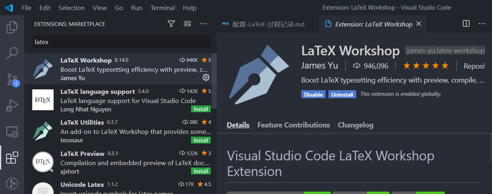
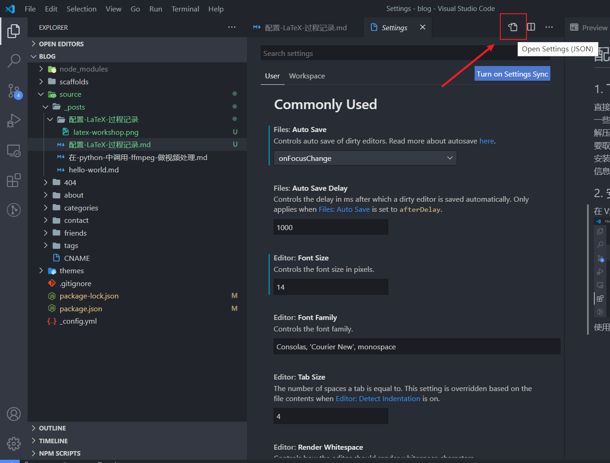

# 配置 LaTeX 过(cai)程(keng)记录
## 1. 下载安装 TeX Live  
直接在官网[下载](http://tug.org/texlive/acquire-netinstall.html) TeX Live，国内用户也可通过[清华镜像](https://mirrors.tuna.tsinghua.edu.cn/CTAN/systems/texlive/Images/)下载，速度会快一些  
解压后双击 `install-tl-advanced.bat` 即可开始安装。可根据个人需要取消勾选某些组件，提高安装速度，节约空间。  
安装完成后，打开 cmd 执行 `tex -version` 命令，若返回 TeX 的版本信息，则安装成功。同样地，验证 `latex -version`  
## 2. 安装与配置 LaTeX Workshop
在 VS Code 中搜索 LaTeX Workshop 插件并安装  

使用 <kbd>Ctrl</kbd>+<kbd>,</kbd> 打开 VS Code 配置界面，点击右上角 <kbd>Open Settings JSON</kbd> 按钮

打开 settings.json，添加如下 json
```
{
    // Latex workshop
    "latex-workshop.latex.tools": [
          {
            "name": "latexmk",
            "command": "latexmk",
            "args": [
            "-synctex=1",
            "-interaction=nonstopmode",
            "-file-line-error",
            "-pdf",
            "%DOC%"
            ]
          },
          {
            "name": "xelatex",
            "command": "xelatex",
            "args": [
            "-synctex=1",
            "-interaction=nonstopmode",
            "-file-line-error",
            "%DOC%"
              ]
          },          
          {
            "name": "pdflatex",
            "command": "pdflatex",
            "args": [
            "-synctex=1",
            "-interaction=nonstopmode",
            "-file-line-error",
            "%DOC%"
            ]
          },
          {
            "name": "bibtex",
            "command": "bibtex",
            "args": [
            "%DOCFILE%"
            ]
          }
        ],
    "latex-workshop.latex.recipes": [
          {
            "name": "xelatex",
            "tools": [
            "xelatex"
                        ]
                  },
          {
            "name": "latexmk",
            "tools": [
            "latexmk"
                        ]
          },

          {
            "name": "pdflatex -> bibtex -> pdflatex*2",
            "tools": [
            "pdflatex",
            "bibtex",
            "pdflatex",
            "pdflatex"
                        ]
          }
        ],
    "latex-workshop.view.pdf.viewer": "tab",  
    "latex-workshop.latex.clean.fileTypes": [
        "*.aux",
        "*.bbl",
        "*.blg",
        "*.idx",
        "*.ind",
        "*.lof",
        "*.lot",
        "*.out",
        "*.toc",
        "*.acn",
        "*.acr",
        "*.alg",
        "*.glg",
        "*.glo",
        "*.gls",
        "*.ist",
        "*.fls",
        "*.log",
        "*.fdb_latexmk"
      ]
}
```
## 3. 测试 LaTeX
新建 tex 后缀文件 test.tex  
输入
```
\documentclass{article}
\begin{document}
Here comes \LaTeX!
\end{document}
```
<kbd>Ctrl</kbd>+<kbd>Alt</kbd>+<kbd>B</kbd> 进行编译  
<kbd>Ctrl</kbd>+<kbd>Alt</kbd>+<kbd>V</kbd> 查看编译完成的 PDF  


## 参考链接
https://www.cnblogs.com/lfri/p/11597427.html